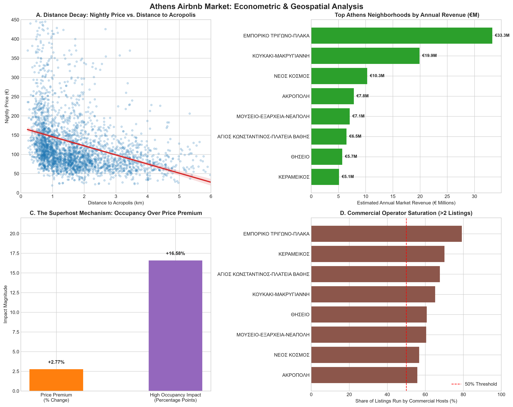

# Athens Airbnb Hedonic Pricing & Demand Analysis

## Overview & Data
Using real short-term rental microdata from **Inside Airbnb** (12,297 active listings in Athens, Greece), this project applies **SQL** and **spatial econometrics in Python** to analyze the pricing strategies and occupancy drivers in the Athens market. 

## Tools & Methods
* **SQL:** Built a normalized relational database (`hosts`, `listings`, `reviews_occupancy`). Used `INNER JOIN`, conditional aggregations (`COALESCE`, `CASE WHEN`), and analytical Window Functions (`RANK() OVER`) to engineer features and rank neighborhood revenues.
* Distance Calculations: Measured the straight-line distance from each listing to the Acropolis. This was achieved by converting the latitude and longitude coordinates into kilometers and applying the Pythagorean theorem to calculate the final distance.
* **Econometrics:** Estimated a Log-Linear Hedonic Pricing Model and a Linear Probability Model (LPM) for High Occupancy. Both models utilized **Huber-White robust standard errors** and **Neighborhood Fixed Effects** to isolate genuine property premiums from regional price inflation.

## Market Dynamics & Econometric Findings

### 1. Market Baseline (N = 12,297 Active Listings)
* **High Commercialization:** **62.0%** of listings are managed by professional multi-property operators.
* **Pricing & Scale:** The average nightly rate is **€128.12** (median: €103.00), with 94.5% of the supply operating as entire homes/apartments. 
* **Baseline Occupancy:** 20.0% of properties achieve high annual occupancy (180+ days booked).

### 2. Hedonic Pricing Model (\(R^2 = 0.5153\))
* **The Distance Penalty:** Holding property size and neighborhood fixed, every 1 km farther from the Acropolis decreases nightly price by **22.5%** (p < 0.0001). 
* **Physical & Operator Premiums:** Adding a bedroom increases the price by **21.4%**. Renting an entire apartment instead of a room commands a **32.8%** premium. Professional hosts (>2 properties) charge **5.0%** more than casual hosts.

### 3. Demand & Occupancy Drivers (LPM)
* **Price Elasticity:** A 10% increase in nightly rate reduces the probability of achieving high occupancy by **1.59 percentage points** (p < 0.0001).
* **The Superhost Mechanism:** While Superhosts only charge a minimal **2.77%** price premium, the badge acts as a powerful trust signal, increasing their probability of hitting high occupancy by **16.58 percentage points** (p < 0.0001).

### 4. Top Revenue Neighborhoods
* **Εμπορικό Τρίγωνο-Πλάκα** leads Athens, generating **€33.27 million** annually across 2,510 listings.
* **Κουκάκι-Μακρυγιάννη** follows closely with **€19.91 million**, successfully balancing high nightly rates (€154.93) with strong booking volumes (110.7 days/year).
* **Παγκράτι** operates differently, serving as a residential hub with lower commercialization (48.3%) but steady demand.

## Recommendations
1. **Optimize for Volume over Premium Pricing:** Hosts should prioritize securing and maintaining Superhost status to drive calendar fill-rates rather than using the badge to extract higher nightly fees.
2. **Geographic Targeting for Investors:** Investments should strictly cluster within a 1.5 km radius of the Acropolis (e.g., Plaka, Koukaki). The 22.5% per-km price penalty severely limits returns on peripheral properties.
3. **Professionalize Operations:** With commercial hosts commanding 62% of the market and extracting a 5% pricing premium, casual hosts must adopt dynamic pricing and professional staging to remain competitive.
